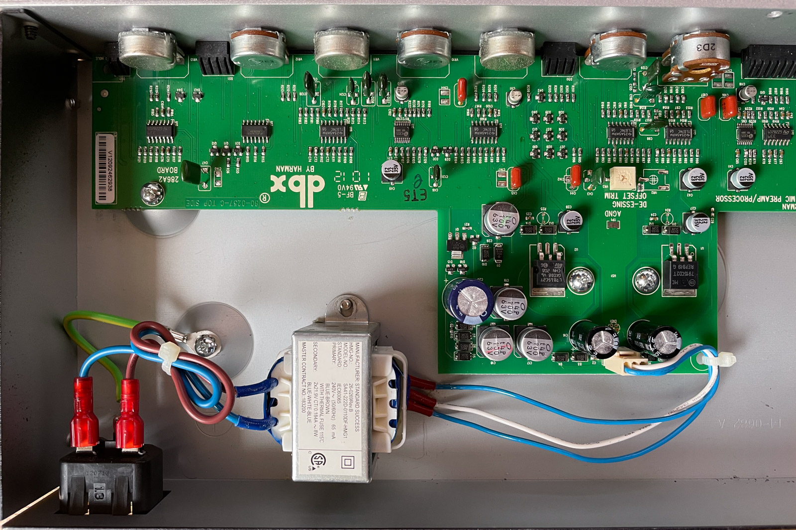
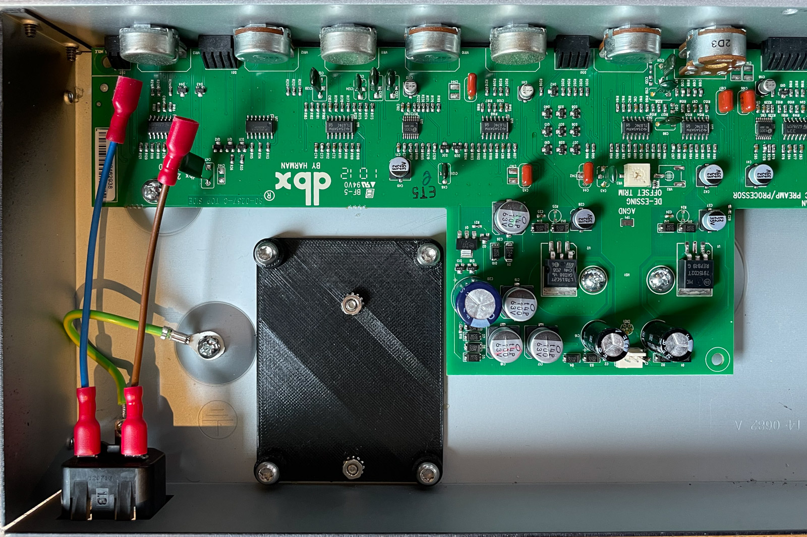
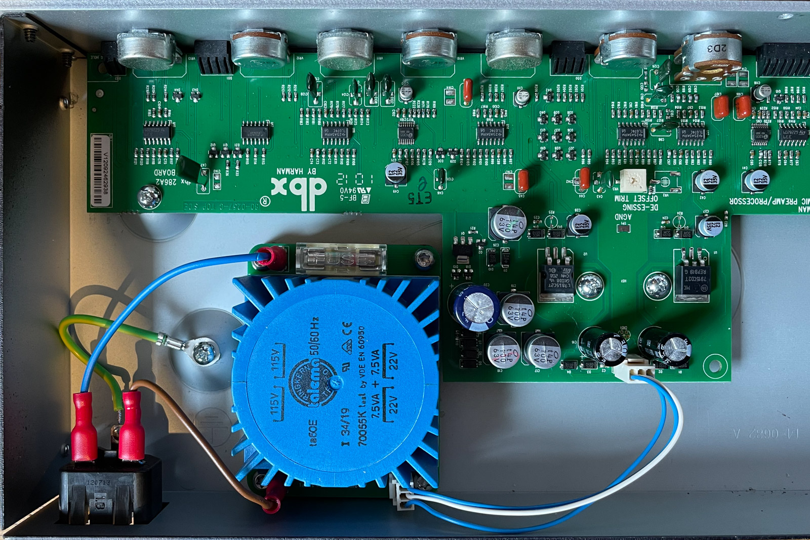

DBX 286S Toroidal Transformer Retrofit
===

[![CC BY-SA 4.0][cc-by-sa-shield]][cc-by-sa]

This work is licensed under a [Creative Commons Attribution-NonCommercial-ShareAlike 4.0 International License][cc-by-sa].

[![CC BY-SA 4.0][cc-by-sa-image]][cc-by-sa]

[cc-by-sa]: http://creativecommons.org/licenses/by-nc-sa/4.0/
[cc-by-sa-image]: https://licensebuttons.net/l/by-nc-sa/4.0/88x31.png
[cc-by-sa-shield]: https://img.shields.io/badge/License-CC%20BY--NC--SA%204.0-lightgrey.svg

## Notes

Pictures show a 15 VA transformer from [talema](https://talema.com). This has more power than actually required. 10 VA and 7 VA versions should also fit on the PCB.

## Bill of materials

* Transformer, e.g. [70055K](https://talema.com/wp-content/uploads/datasheets/70000K-72400K.pdf). Smaller power (10 VA and 7 VA) and even smaller voltages (2x 18 V) might also work, but untested.
* 2 Faston Tabs from TE, 1217332-1, e.g. [571-1217332-1
 from Mouser](https://www.mouser.de/ProductDetail/571-1217332-1)
* Fuse Holder, e.g. [C58066 from LCSC](https://lcsc.com/product-detail/Fuse-Holders_Xucheng-Elec-C58066_C58066.html)
* Connector from MOLEX, 22272021, e.g. [C293316 from LCSC](https://lcsc.com/product-detail/Wire-To-Board-Wire-To-Wire-Connector_MOLEX-22272021_C293316.html)
* Glass fuse
* M4 Screws
* Cables

## Images

